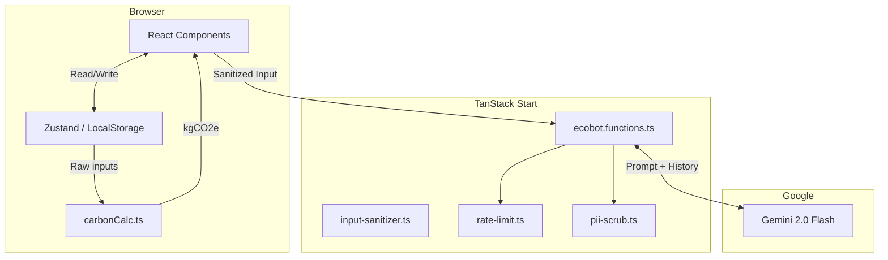

# carbone — Architecture

## Data Flow

Carbone uses a client-heavy, server-light architecture. The primary state is kept in the user's browser via `localStorage`, ensuring privacy and immediate interactivity.

## Core Modules

### 1. The Calculator (`src/utils/carbonCalc.ts`)

The mathematical heart of the app. It exports pure functions that take domain-specific inputs (e.g., `km`, `energy units`) and return `kgCO2e`. It is 100% covered by unit tests, including property-based tests using `fast-check` to guarantee monotonicity and non-negative outputs.

### 2. The Data Store (`src/components/Layout/activities-store.ts`)

A custom hook wrapping `localStorage`. It manages the list of user activities and committed actions. It includes hydration-gating to prevent SSR mismatch errors.

### 3. The AI Proxy (`src/lib/ecobot.functions.ts`)

A TanStack Server Function that proxies requests to the Gemini API. It enforces:

- **Rate limiting** via `src/lib/rate-limit.ts`
- **PII scrubbing** via `src/lib/pii-scrub.ts`
- **Payload size guarding** and timeouts
- **Schema validation** using Zod

### 4. Input Sanitization (`src/lib/input-sanitizer.ts`)

Provides defense-in-depth HTML entity encoding for user-generated strings before they are processed or rendered, complementing React's built-in escaping.

## Routing

Managed by TanStack Router. Routes are file-based and located in `src/routes/`.

- `/` - Dashboard
- `/tracker` - Data entry
- `/insights` - Analytics
- `/actions` - Commitments
- `/chat` - EcoBot interface
